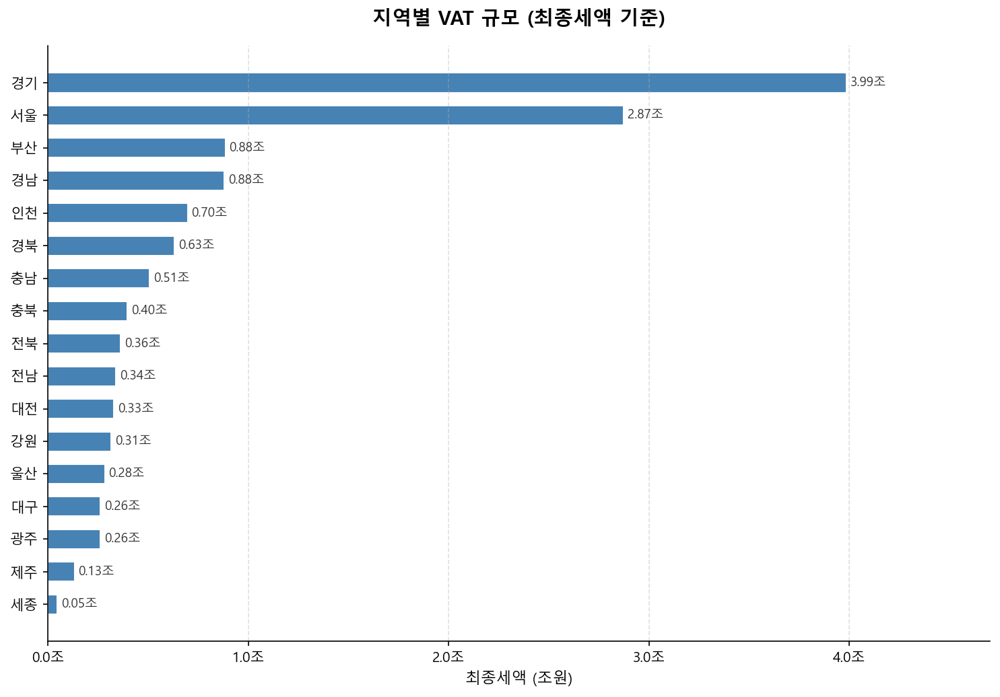
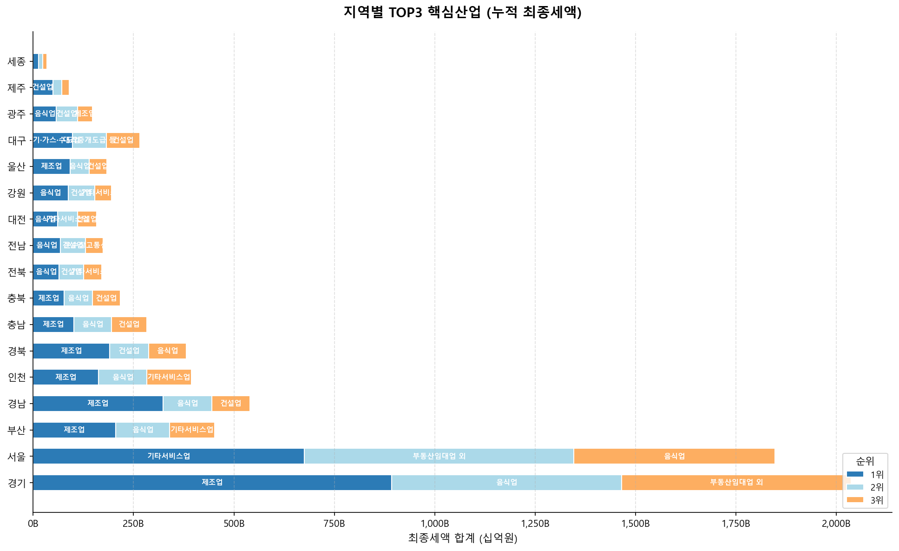
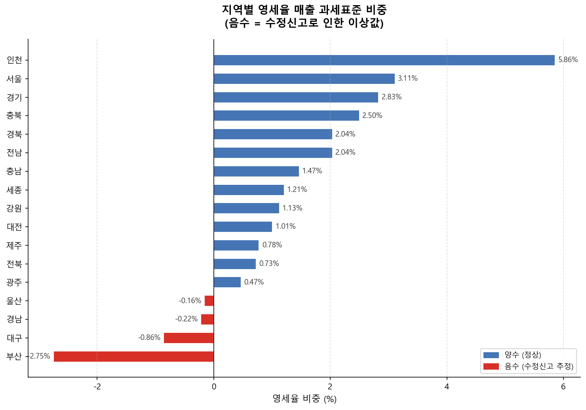
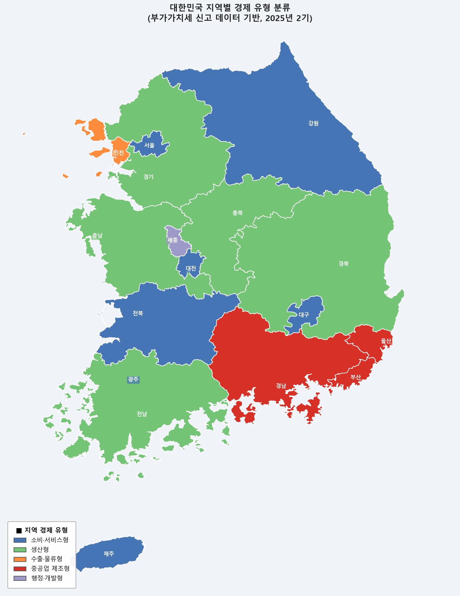

# 📊 세금으로 지역을 읽는다

### 부가가치세 데이터를 활용한 지역 산업구조 분석

---

| VAT 규모 | TOP3 산업 | 영세율 비중 | 지역 유형 지도 |
|:---:|:---:|:---:|:---:|
|  |  |  |  |

---

## 📌 Project Overview

부가가치세(VAT)는 지역의 경제활동을 보여주는 대표적인 세금 데이터이다.

하지만 단순히 부가가치세 납부액만 비교하면 지역의 산업 특성을 올바르게 이해하기 어렵다. 제조업, 수출업, 영세율 적용 여부 등 부가가치세 제도의 영향으로 동일한 경제활동이라도 VAT는 다르게 나타날 수 있기 때문이다.

본 프로젝트는 국세청 부가가치세 신고현황 데이터를 활용하여 지역별 산업구조를 분석하고, 영세율 과세표준을 함께 고려하여 VAT 데이터를 어떻게 해석해야 하는지를 분석하였다.

---

# 🎯 Objectives

* 지역별 부가가치세 규모 비교
* 지역별 핵심 산업(TOP3) 분석
* 지역별 영세율 과세표준 비중 분석
* 산업구조와 영세율을 결합한 지역 유형 분류
* 부가가치세 데이터를 세법 관점에서 해석

---

# 📂 Dataset

* 국세청 국세통계포털
* 2025년 제2기 일반사업자 지역별·업태별 부가가치세 신고현황

사용 변수

* Region
* Industry
* Number of Returns
* Tax Base
* Zero-rate Tax Base
* VAT Amount

---

# 🛠 Tech Stack

* Python
* Pandas
* MySQL
* SQL
* Matplotlib
* Git / GitHub

---

# 📈 Analysis Process

### Q1. 데이터는 어떻게 구성되어 있는가?

* 지역 수
* 업종 수
* 신고 건수 확인

➡️ 결과

(Chart 1 삽입)

---

### Q2. 지역별 VAT 규모는 어떻게 다른가?

지역별 부가가치세 규모를 비교하여 지역 간 VAT 분포를 확인하였다.

(Chart 2 삽입)

---

### Q3. 지역별 핵심 산업은 무엇인가?

각 지역에서 과세표준 비중이 가장 높은 산업을 분석하였다.

(Chart 3 삽입)

예시

* 서울 : 서비스·금융
* 경기 : 제조업
* 제주 : 관광
* 인천 : 제조·물류

---

### Q4. 지역별 영세율 과세표준은 어떻게 다른가?

영세율 과세표준 비중을 분석하여 지역별 산업 특성을 비교하였다.

(Chart 4 삽입)

---

### Q5. 산업구조와 영세율을 함께 보면 어떻게 해석할 수 있는가?

지역을 다음 네 가지 유형으로 분류하였다.

| Type       | Description                  |
| ---------- | ---------------------------- |
| 🟢 소비·서비스형 | 서비스·음식업 중심, 내수 소비 비중이 높은 지역  |
| 🟡 생산형     | 제조업 중심, 생산과 내수가 함께 발달한 지역    |
| 🔵 수출·물류형  | 제조업과 물류 중심, 영세율 비중이 높은 지역    |
| ⚙️ 중공업 제조형 | 중공업 제조 중심, 영세율 음수 사례가 나타난 지역 |

(대한민국 유형 지도 삽입)

---

# 💡 Key Findings

* 부가가치세 규모만으로는 지역의 산업 특성을 설명하기 어렵다.
* 동일한 제조업 중심 지역이라도 영세율 과세표준 비중에 따라 산업 특성이 다르게 나타났다.
* 영세율 과세표준을 함께 분석하면 수출 중심 산업과 내수 중심 산업을 구분할 수 있었다.
* 일부 지역에서는 영세율 과세표준이 음수로 집계되었으며, 이는 수정신고·경정 등 신고 특성이 반영된 결과로 해석하였다.

---

# 📌 Conclusion

본 프로젝트는 단순한 VAT 규모 비교가 아니라 산업구조와 부가가치세 제도를 함께 고려하여 지역의 산업 특성을 해석하였다.

이를 통해 동일한 세금 데이터라도 세법적 배경을 함께 이해해야 올바른 데이터 해석이 가능함을 확인하였다.
